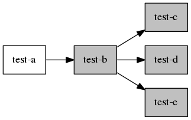
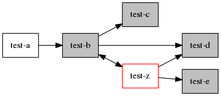

Test: insert a dependency with an internal cycle
================================================

Description
-----------

Verify the state of Auto flags of the dependencies of a package after a
new internal dependency cycle is set between two auto-installed packages
(both packages now depend on each other).

Procedure
---------

 1. Generate the initial repository with the packages `test-a`,
    `test-b`, `test-c`, `test-d`, `test-e`

 2. Install the package `test-a` The other packages will be
    automatically installed by dependencies.

    

 3. Update the repository to bring in the updated `test-b` and
    the new `test-z` with the dependency cycle between them.

 4. Upgrade. The package `test-b` should be updated and the
    new `test-z` automatically installed by dependencies.

    

After the step 4 the packages `test-b`, `test-c`, `test-d`, `test-e`,
and `test-z` should all keep the Auto flags set.

