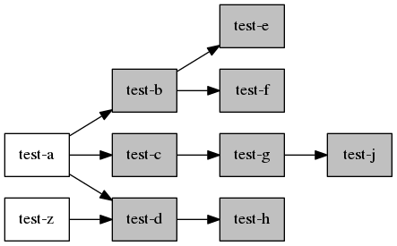
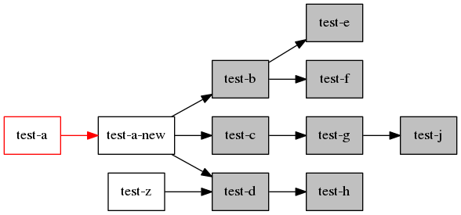

Test: renaming a package
========================

Description
-----------

Verify the state of Auto flags of the dependencies of a package that has
been renamed during a upgrade.

Procedure
---------

 1. Generate the initial repository with the packages `test-a`,
    `test-b`, `test-c`, `test-d`, `test-e`, `test-f`, `test-g`,
    `test-h`, `test-j`, `test-z`

 2. Install the packages `test-a` and `test-z`. The other packages will
    be automatically installed by dependencies.

    

 3. Update the repository with the new packages `test-a-new` and
    `test-a`.

 4. Upgrade. The package `test-a` should be updated and `test-a-new`
    installed.

    

After the step 4 the packages `test-b`, `test-c`, `test-d`, `test-e`,
`test-f`, `test-g`, `test-h` and `test-j` should keep the Auto flags
set.

